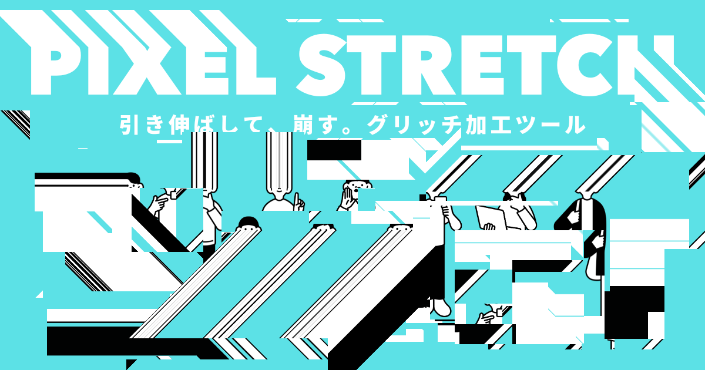

# PIXEL STRETCH

**[English](README.md) | [日本語](README.ja.md)**

> 引き伸ばして、崩す。ブラウザだけで完結するグリッチ加工ツール。

**[→ ツールを開く](https://pixel-stretch-gilt.vercel.app/)** — インストール不要、登録不要。



---

## これは何か

ブラウザで動くグリッチ加工ツールです。画像を読み込み、ドラッグで範囲を選び、
そのままドラッグすると、その範囲のピクセルが引き伸ばされたり、ずれたり、
巻き込まれたりします。ピクセルストレッチ系の代表的な見た目を5つのモードで扱えます。

処理はすべてブラウザ内で完結します。画像がどこかに送信されることはありません。

## なぜ作ったか

Xを眺めていたらピクセルストレッチのエフェクトが流れてきて、自分でもやってみたい
と思いました。ただ、手軽な代替手段が思い浮かばない。Photoshopでちまちまやるのも
違う気がする。そして何より、簡単に作れそうな気がした。やっていることは
「選んだ範囲のピクセルを引き伸ばす」だけです。

ちょうどClaudeを使った開発を練習したかったので、作りたいものがあって、作れそうで、
練習にもなる。3つ揃ったので手を動かし始めました。

## コードは1行も書いていない

このツールのコードは1行も書きませんでした。Claude Desktopに「こういうものを作りたい」
と伝えて、出てきたものを触って、違うところを指摘して、直してもらう。これを繰り返して
基本機能はひととおり動くようになりました。

フォントをターミナル・IDE寄りに変え、配色をオフホワイトに統一する調整は、
途中からClaude Designを使って行っています。

わかったのは、実装力がボトルネックではなくなったということ。何を作りたいかさえ
決まっていれば、あとは対話で形になります。

## モード

| モード | 効果 |
|--------|------|
| **Wipe** | 選択範囲の端のピクセルをそのまま引き伸ばす。いわゆるピクセルストレッチ |
| **Slide: White** | 選択範囲をずらして、空いたところを白で埋める |
| **Slide: Reveal** | ずらして、下から元の画像を露出させる |
| **Slide: Scroll** | 選択範囲の中だけで画像がループする |
| **Slide: Push** | 選択範囲を押し出して、周りのピクセルを巻き込む |

## 使い方

1. 画像をページにドロップするか、**Open** を押す。`SAMPLE` でサンプル画像を読み込めます
2. ツールバーからモードを選ぶ
3. 画像の上をドラッグして範囲を選ぶ
4. もう一度ドラッグすると加工されます。動かしている間はプレビューで、離すと確定します
5. **Save** でPNGとして保存

`Padding` はキャンバスの周囲に余白を足す設定です。引き伸ばす先を確保できます。
ズームのイン／アウト／フィットはツールバーにあります。

デスクトップだけでなくタッチデバイスでも動作します。

## キーボードショートカット

| キー | 動作 |
|------|------|
| `Enter` | 保存 |
| `Z` | 元に戻す |
| `1` | リセット |

## 技術メモ

- `index.html` 1ファイル構成。ビルド手順もフレームワークもパッケージマネージャもなし
- 外部依存はTabler IconsのCDN 1本のみ
- 処理はすべてブラウザの `<canvas>` 上。サーバーには何も送りません
- 出力はPNG
- Vercelに静的サイトとして配置。ビルド設定は不要

## ローカルで動かす

```bash
git clone https://github.com/naotobando/pixel-stretch.git
cd pixel-stretch
```

あとは `index.html` をブラウザで開くだけです。サーバーは要りません。

## ライセンス

MIT

## フィードバック

不具合・要望は [GitHub Issues](https://github.com/naotobando/pixel-stretch/issues) へ。
