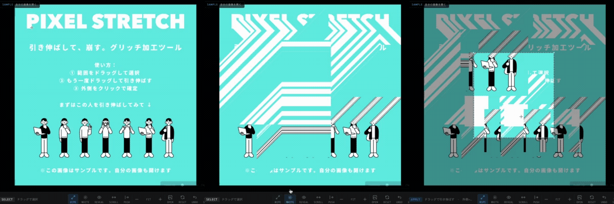

# PIXEL STRETCH

**[English](README.md) | [日本語](README.ja.md)**

> Drag to stretch. Break the image. A glitch tool that runs entirely in your browser.

**[→ Open the tool](https://pixel-stretch-gilt.vercel.app/)** — no install, no sign-up.



---

## What is this?

A browser-based glitch art tool. Load an image, drag to select a region, then drag
again — the pixels inside that region stretch, slide, or smear. Five modes cover the
common pixel-stretch and slide-glitch looks.

Everything runs locally in your browser. Images are never uploaded anywhere.

## Why I built this

I saw a pixel stretch effect on X and wanted to make one myself. But there was no
handy way to do it — going at it by hand in Photoshop felt wrong for something this
simple. And it looked buildable: all it really does is stretch the pixels inside a
selected region.

I also wanted practice building things with Claude. Something I wanted, something
that looked achievable, and useful practice — three reasons lined up, so I started.

## Built without writing code

Not one line of this was written by hand. I described what I wanted to Claude Desktop,
tried what came back, pointed out what was off, and had it fixed — over and over,
until the features worked. The typography (terminal/IDE-leaning monospace) and the
off-white palette came later, through Claude Design.

What I took from it: implementation is no longer the bottleneck. If you know what you
want to make, the rest is conversation.

## Modes

| Mode | What it does |
|------|--------------|
| **Wipe** | Stretches the edge pixels of the selection outward. The classic pixel stretch. |
| **Slide: White** | Slides the selection and fills the gap with white. |
| **Slide: Reveal** | Slides the selection, exposing the original image underneath. |
| **Slide: Scroll** | Loops the image within the selection only. |
| **Slide: Push** | Pushes the selection outward, dragging the surrounding pixels along. |

## How to use

1. Drop an image onto the page, or press **Open**. `SAMPLE` loads a sample image.
2. Pick a mode from the toolbar.
3. Drag across the image to select a region.
4. Drag again to apply. The result previews while you move and commits when you release.
5. **Save** downloads a PNG.

`Padding` adds margin around the canvas, so there is somewhere to stretch into.
Zoom in / out / fit are in the toolbar.

Works on touch devices as well as desktop.

## Keyboard shortcuts

| Key | Action |
|-----|--------|
| `Enter` | Save |
| `Z` | Undo |
| `1` | Reset |

## Tech notes

- A single `index.html`. No build step, no framework, no package manager.
- Only external dependency: Tabler Icons over CDN.
- All processing happens on a `<canvas>` in the browser. Nothing is sent to a server.
- Output is PNG.
- Hosted on Vercel as a static site — no build configuration needed.

## Run it locally

```bash
git clone https://github.com/naotobando/pixel-stretch.git
cd pixel-stretch
```

Then open `index.html` in your browser. No server required.

## License

MIT

## Feedback

Bugs and requests: [GitHub Issues](https://github.com/naotobando/pixel-stretch/issues).
